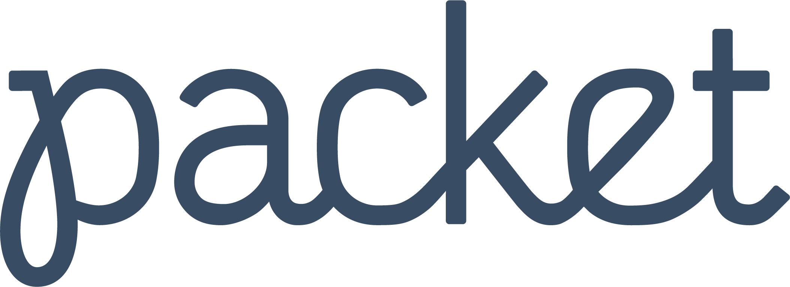

# Viscerion, Unofficial Android client for [WireGuard](https://www.wireguard.com/)

[](https://build.msfjarvis.website/msfjarvis/viscerion) [](https://github.com/msfjarvis/viscerion/actions) [](https://crowdin.com/project/viscerion) [](https://dependabot.com)

<a href='https://play.google.com/store/apps/details?id=me.msfjarvis.viscerion&utm_source=GitHub&pcampaignid=MKT-Other-global-all-co-prtnr-py-PartBadge-Mar2515-1'></a>

Refreshed take at the official Android client with a nicer UI and additional features. Built with the best of [Android Jetpack](https://developer.android.com/jetpack/).

## Building

```
$ git clone https://github.com/msfjarvis/viscerion --recursive
$ cd viscerion
$ ./gradlew assembleDebug
```

Note: on macOS you also need to install the GNU `coreutils` package through homebrew.

## Contributing

Please read the contribution guidelines at [CONTRIBUTING.md](CONTRIBUTING.md).

## Support development

Viscerion is developed solely by me as a side project that has overgrown the ideal size of one. Continuing development on this alongside my college is very draining for no real gain. The open source Kumbaya has worn off for me and [GitHub stars don't pay my bills](https://medium.com/@kitze/github-stars-wont-pay-your-rent-8b348e12baed), so having actual monetary compensation would justify my time spent so far and motivate me to dedicate more of it to this project.

[](https://flattr.com/@msfjarvis)
<br />
[](https://ko-fi.com/L4L61438E)

CI infrastructure provided by

<a href='https://www.packet.net'></a>
